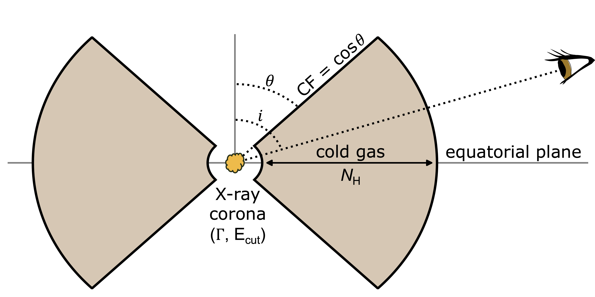
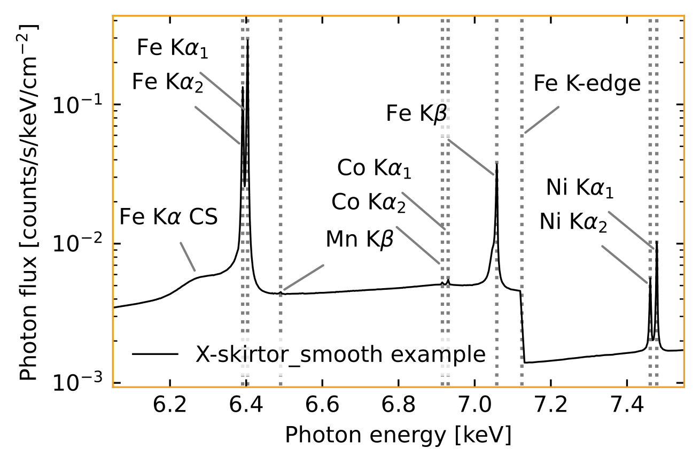

# X-skirtor

X-ray torus models for the microcalorimeter era. Calculated with [SKIRT](https://ui.adsabs.harvard.edu/abs/2023A%26A...674A.123V).

## I. X-skirtor_smooth: A smooth torus model for XRISM/Resolve

X-skirtor_smooth is the first X-ray torus model calculated with SKIRT, modelling X-ray reprocessing by cold gas.

<table>
  <tr>
    <td></td>
    <td></td>
  </tr>
  <tr>
    <td align="center"><strong>Smooth Torus Geometry</strong><br/>X-skirtor_smooth adopts a smooth torus geometry.<br/>Future models will focus on more complex geometries.</td>
    <td align="center"><strong>Example Model Spectrum</strong><br/>High spectral resolution and S/N.<br/>Intrinsic line shapes. Smooth Compton shoulder.</td>
  </tr>
</table>

--

### Download the model:

[📥 xskirtor_smooth_xrism](https://sron365-my.sharepoint.com/:u:/g/personal/b_vander_meulen_sron_nl/IQACzE10-7LsT4I2wtFzUWb8AWlHEXdOq-q2qqIefNeGqV4) — Suited for XRISM/Resolve data, with an adaptive energy resolution (1.5–15 keV)

[📥 xskirtor_smooth_ccd](https://sron365-my.sharepoint.com/:u:/g/personal/b_vander_meulen_sron_nl/IQCXli9pZkjgR64Pp1VdN7PhAR-32zEqrzVqxwOfJCjsGWE) — Suited for broadband CCD data, with a spectral resolution of R=433 (0.2–200 keV)

--

### Use the model in XSPEC:

```xspec
model atable{xskirtor_smooth_tot.mod}
```
which is exactly identical to:
```xspec
model atable{xskirtor_smooth_rpc.mod} + atable{xskirtor_smooth_dir.mod}
```
when the parameters of the reprocessed and direct (i.e. transmitted) flux components are tied.

*The same tables are also supported by: **SPEX**, **SHERPA**, **ISIS**.*

--

### References:

Please refer to X-skirtor_smooth (Vander Meulen et al., subm.), calculated with the SKIRT code ([Vander Meulen et al., 2023](https://ui.adsabs.harvard.edu/abs/2023A%26A...674A.123V)).
